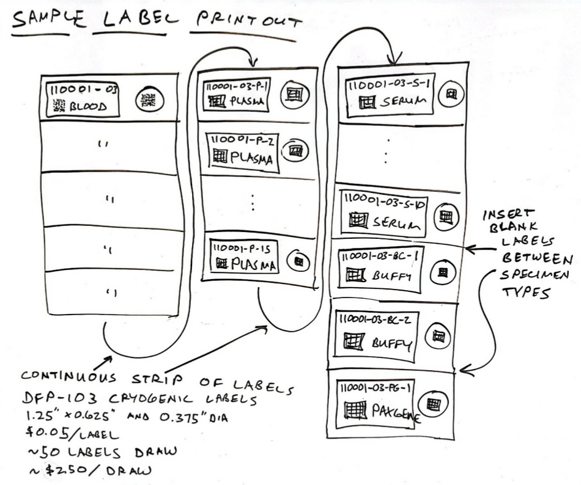

# Tube Label Generator

Description

## Prerequisites
 - REDCap >= 14.0.2
 - PHP >= 8

## Easy installation

None! This module is not yet intended for public consumption.

## Manual Installation
- Clone this repo into to `<redcap-root>/modules/tube_label_generator_v0.0.0`.

## Introduction
The __Tube Label Generator__ external module adds a __Generate Labels__ page underneath __External Modules__ to print zpl labels using the _ADC Subject ID field_ and _Visit number field_ options mentioned in the [Project Configuration](#project-configuration) section below. The labels are __DFP-103 Cryogenic Labels__. For example:
> 
The labels include a barcode string (`110001-03-S-1`) with the following breakdown:
> 

## Global Configuration

N/A

## Project Configuration

- **Input Base**: The numeric base system of your input, usually 10
- **Output Base**: Up to 36, note that you will need to use an even number for the [checksum algorithm to work](https://en.wikipedia.org/wiki/Luhn_mod_N_algorithm#Limitation)
- **ADC Subject ID field**: The field that contains the ptid.
- **Visit number field**: The field that contains the visit number. 

## Use

Go to the "Generate Labels" page.

