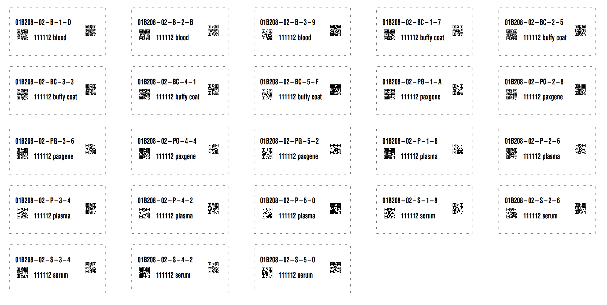

# Tube Label Generator

Description

## Prerequisites
 - REDCap >= 14.0.2
 - PHP >= 8

## Easy installation

None! This module is not yet intended for public consumption.

## Manual Installation
- Clone this repo into to `<redcap-root>/modules/tube_label_generator_v0.0.0`.

## Introduction
The __Tube Label Generator__ external module adds an action tag, @TUBE-LABEL-GENERATOR that will present a button to generate a page of biospecimen labels. The button will appear to the right of any field that has the action tag. The button will display a plugin with an array of print zpl labels using values in the fields specified in the module configuration, the _Subject ID field_ and _Visit number field_ options mentioned in the [Project Configuration](#project-configuration) section below. The labels are __DFP-103 Cryogenic Labels__. For example:
> 
The labels include a barcode string (`110001-03-S-1`) with the following breakdown:
> 

## Global Configuration

N/A

## Project Configuration

- **Input Base**: The numeric base system of your input, usually 10
- **Output Base**: Up to 36, note that you will need to use an even number for the [checksum algorithm to work](https://en.wikipedia.org/wiki/Luhn_mod_N_algorithm#Limitation)
- **Subject ID field**: The field that contains the ptid.
- **Visit number field**: The field that contains the visit number. 

Then use the @TUBE-LABEL-GENERATOR action tag on the field where you the "Generate biospecimen labels" button to be displayed. Typically this would be the visit number field. The button will appear to the right of the data entry field. Only one @TUBE-LABEL-GENERATOR action tag is supported per form, any additional fields marked with the tag will be ignored.

> 

## Use

Access the form where the Visit Number field is set. The button should appear to the right of the visit number data entry field. The field will be grayed out if the viit number is missin. Key in the visit number then press the "Generate biospecimen labels" button. This will display the page of biospecimen labels.

> 
